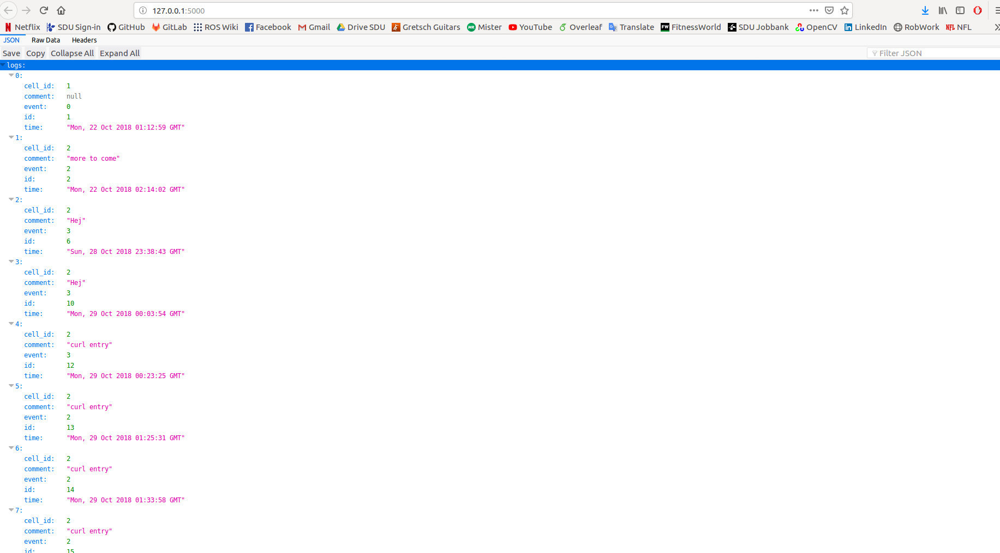
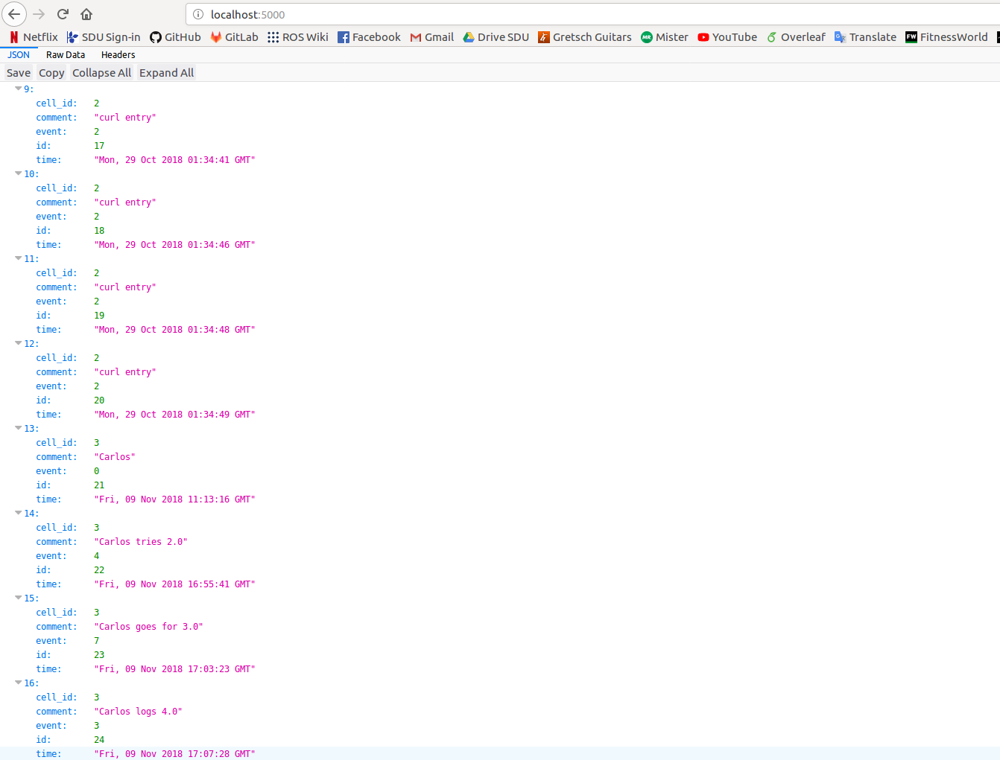
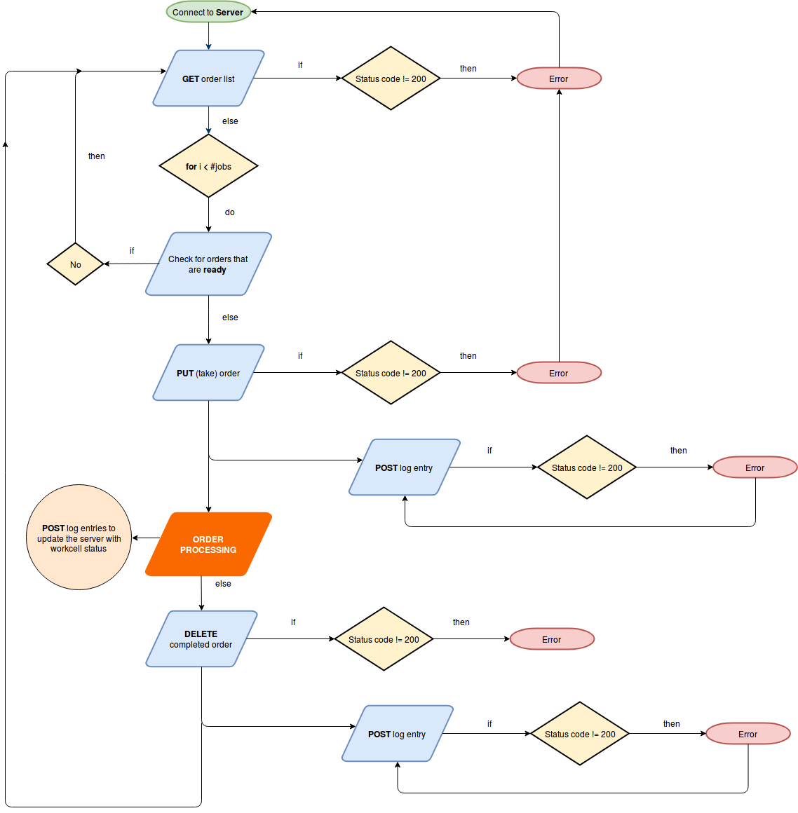

# RSD MES SYSTEM

RESTful API designed for the project in the course Robot Systems Design (University of Southern Denmark). The objective is to run and process the orders that the robot workcell has to do. Cell number: 3.

**Software requirments:**

 - Python3 venv virtual environment to run the server.
 - Python Flask, and its Flask-MySQL extension for running the server.
 - MySQL.
 - Flask SQL-alchemy.
 - Python Requests for the client side.

## 1. Server 

The MES system is made in Python3 and are using Flask with a SQL extension for the REST api.

The system also need a MySQL v8 db to run. 

Included are a python file for the Flask server and a SQL export, that shows the structure of the "rsd" SQL db.

In the Python code you can see the configuration for the database in order for the python code to access the SQL db.

Note: the MES server will automatic add more jobs, when they are below 5. This is just a sample code - the final system have another behavior, but this shows the idea.

_[Note provided in the lecture]_

### 1.1. Setting up

 - **Install Flask:**

 Create virtual environment:

 ```sh
 $ sudo apt-get install python3-venv
 $ python3 -m venv venv
 ```

 Activate virtual environment and install Flask:

 ```sh 
 $ . venv/bin/activate
 $ pip install --upgrade pip
 $ pip install Flask
 ```
 - **Install Flask-MySQL extension:**

 In the virtual environment run:

 ```sh
 $ pip install flask-mysql
 $ pip show flask-mysql

 Name: Flask-MySQL
 Version: 1.4.0
 Summary: Flask simple mysql client
 Home-page: https://github.com/cyberdelia/flask-mysql/
 Author: Timothee Peignier
 Author-email: timothee.peignier@tryphon.org
 License: BSD
 Location: /.../RSD2018/RSD2018/Server/venv/lib/python3. 5/site-packages
 Requires: Flask, PyMySQL
 Required-by: 
 ```

 - **Install SQL-alchemy by Flask:**
 
 In the virtual environment:

 ```sh
 $ pip install flask-sqalchemy
 $ pip show sqlalchemy

 Name: SQLAlchemy
 Version: 1.2.13
 Summary: Database Abstraction Library
 Home-page: http://www.sqlalchemy.org
 Author: Mike Bayer
 Author-email: mike_mp@zzzcomputing.com
 License: MIT License
 Location: /.../RSD2018/RSD2018/Server/venv/lib/python3.5/site-packages
 Requires: 
 Required-by: Flask-SQLAlchemy

 # For python3:
 $ pip install mysqlclient
 $ pip show mysqlclient

 Name: mysqlclient
 Version: 1.3.13
 Summary: Python interface to MySQL
 Home-page: https://github.com/PyMySQL/mysqlclient-python
 Author: INADA Naoki
 Author-email: songofacandy@gmail.com
 License: GPL
 Location: /.../RSD2018/RSD2018/Server/venv/lib/python3.5/site-packages
 Requires: 
 Required-by: 
 ```
 - **Install MySQL server:**

 In a new terminal (out of the virtual environment):

 ```sh
 $ sudo apt-get update
 $ sudo apt-get install mysql-server
 ```
 Run secure installation to change some default unsecure settings that come with MySQL:

 ```sh
 $ mysql_secure_installation
 ```

 Check that installation was succesful and MySQL is up and running:

 ```sh
 $ systemctl status mysql.service
 ```

 The output should be:
 
 ```sh
 ● mysql.service - MySQL Community Server
   Loaded: loaded (/lib/systemd/system/mysql.service; enabled; vendor preset: en
   Active: active (running) since Mon 2018-11-05 11:44:43 CET; 6min ago
  Main PID: 12995 (mysqld)
   CGroup: /system.slice/mysql.service
           └─12995 /usr/sbin/mysqld

 Nov 05 11:44:42 rohan systemd[1]: Starting MySQL Community Server...
 Nov 05 11:44:43 rohan systemd[1]: Started MySQL Community Server.
 ```

Finally, try to run _mysqladmin_, which is a client that lets you run administrative commands and ask for the version of the installation:

```sh
 $ mysqladmin -p -u root version
 Enter password: 

 mysqladmin  Ver 8.42 Distrib 5.7.24, for Linux on x86_64
 Copyright (c) 2000, 2018, Oracle and/or its affiliates. All rights reserved.

 Oracle is a registered trademark of Oracle Corporation and/or its
 affiliates. Other names may be trademarks of their respective
 owners.

 Server version		5.7.24-0ubuntu0.16.04.1
 Protocol version	10
 Connection		Localhost via UNIX socket
 UNIX socket		/var/run/mysqld/mysqld.sock
 Uptime:			11 min 49 sec

 Threads: 1  Questions: 10  Slow queries: 0  Opens: 115  Flush tables: 1  Open tables: 34  Queries per second avg: 0.014
```

### 1.2. Running the server

  The server must be run inside the virtual environment, so keep a terminal opened with **venv** activated.

 - **Database configuration:**

 To create the _rsd_ user, open a new terminal:

 ```sh
 $ mysql -u root -p
 mysql> create user 'rsd'@'localhost' identified by 'rsd2018';
 mysql> grant all privileges on *.* to 'rsd'@'localhost';
 mysql> create database rsd2018;
 mysql> quit
 ```

 If running on Ubuntu 16.04, open the .sql file and search \& replace the lines that contain `ENGINE=InnoDB DEFAULT CHARSET=utf8mb4 COLLATE=utf8mb4_unicode_520_ci;` with `ENGINE=InnoDB DEFAULT CHARSET=utf8 COLLATE=utf8_general_ci;`. Then, add _db\_export.sql_ to user _rsd_ under the name of _rsd2018_ with the command:

 ```sh
 $ mysql -u rsd -p rsd2018 < db_export.sql 
 ```

 - **Running on Flask:**

 From the virual environment:

 ```sh
 $ export FLASK_APP=rsd_2018_app.py
 # Run with Flask:
 $ flask run
 # Run with Python:
 $ Python -m flask run
 # Don't know if there is a difference...
 ```
 
 - **Execution bug:**

 ```sh
 $ . venv/bin/activate
 (venv)$ export FLASK_APP=rsd_2018_app.py 
 (venv)$ python -m flask run

 * Serving Flask app "rsd_2018_app.py"
 * Environment: production
   WARNING: Do not use the development server in a production environment.
   Use a production WSGI server instead.
 * Debug mode: off
 * Running on http://127.0.0.1:5000/ (Press CTRL+C to quit)
 Exception in thread Thread-1:
 Traceback (most recent call last):
  File "/usr/lib/python3.5/threading.py", line 914, in _bootstrap_inner
    self.run()
  File "/usr/lib/python3.5/threading.py", line 862, in run
    self._target(*self._args, **self._kwargs)
  File "/home/charlie/Workspace/WebProgramming/RSD2018/RSD2018/Server/rsd_2018_app.py", line 24, in run_job
    con = mysql.connect()
  File "/home/charlie/Workspace/WebProgramming/RSD2018/RSD2018/Server/venv/lib/python3.5/site-packages/flaskext/mysql.py", line 39, in connect
    if self.app.config['MYSQL_DATABASE_HOST']:
 AttributeError: 'NoneType' object has no attribute 'config'
 ```

 It is due to missing `con.close()` statement (closing the connection to the database after adding a new job). This issue makes the function that adds jobs to get stuck after the first entry in the database. However, it does not affect the REST API and that is why the other parts of the server work.

 


## 2. WorkCell Client.

 The REST Client can interact with the server using the following entries and methods:

 ### 2.1. Explanation

 1. **Logs (POST):**

 What is the url `/logs` for?

 Post a new entry to http://localhost:5000/log. Log entries require the following fields:

 - _cell\_id_: **int type**, number of the WorkCell.
 - _comment_: **string type**, comment attached to the entry.
 - _event_: **string type**, event type, PML\_Idle ...
 - _id_: Maybe ID inside the database? Auto-generated.
 - _time_: time stamp, autogenerated.
 
 ```sh
 $ cd /.../RSD2018/Server/Client/
 $ python POST_example.py

 POST request into RSD server in http://localhost:5000/ 

 The following log was posted: "cell_id: 3, comment: Carlos logs 4.0, event: PML_Held"
 ('Status code: ', 200)
 Log entry was succesfully added. Refresh the browser to see it on the server.
 ```
 

 2. **Orders (GET):**

 Returns a list of the orders available in the database. URL: http://localhost:5000/orders.

 ```sh
 $ python GET_orders_example.py

 GET request for ORDERS in RSD server in http://localhost:5000/ 

 (' >> Status code: ', 200)
 (' >> Text: ', u'{"orders":[{"blue":2,"id":1,"red":1,"status":"ready","yellow":0}]}\n')
 (' >> JSON: ', <bound method Response.json of <Response [200]>>)
 ```
 
 3. **Event Types (GET):**

 Returns the list of event types. URL: http://localhost:5000/event_types.

 ```sh
 $ python GET_events_example.py 
 
 GET request for EVENT TYPES in RSD server in http://localhost:5000/ 

 (' >> Status code: ', 200)
 (' >> Text: ', u'{"EventTypes":["PML_Idle","PML_Execute","PML_Complete","PML_Held","PML_Suspended","PML_Aborted","PML_Stopped","Order_Start","Order_Done"]}\n')
 (' >> JSON: ', <bound method Response.json of <Response [200]>>)
 ```

 4. **Orders by id (GET, PUT, DELETE):**

 To manipulate an order by its ID use the URL http://localhost:5000/orders/1 (order\_id = 1).

 PUT method is used to update an order. This has to be done when the system takes an  brand new fresh order from the server, to change the order **status** from _ready_ to _taken_.

 DELETE method is used to eliminate an order that has been completed from the database.

 ```sh
 $ python db_order_example.py 
 
GET request for ORDER with ID:1 in RSD server in http://localhost:5000/ 

(' >> Status code: ', 200)
(' >> Text: ', u'{"order":[{"blue":2,"id":1,"red":1,"status":"ready","yellow":0}]}\n')
PUT request for ORDER with ID=1 in RSD server in http://localhost:5000/ 

(' >> Status code: ', 200)
Getting order with ID=1 updated.
(' >> Text: ', u'{"order":[{"blue":2,"id":1,"red":1,"status":"taken","yellow":0}]}\n')
 ```

 ### 2.2. Status tracking.

 On success the status code of all REST responses is 200. To check for errors check the server's command line:

 ```sh
 * Running on http://127.0.0.1:5000/ (Press CTRL+C to quit)
 127.0.0.1 - - [10/Nov/2018 11:54:49] "GET / HTTP/1.1" 200 -
 127.0.0.1 - - [10/Nov/2018 12:17:03] "POST /log HTTP/1.1" 200 -
 127.0.0.1 - - [10/Nov/2018 12:17:08] "GET / HTTP/1.1" 200 -
 127.0.0.1 - - [10/Nov/2018 12:17:27] "GET /orders HTTP/1.1" 200 -
 127.0.0.1 - - [10/Nov/2018 12:27:28] "GET /orders HTTP/1.1" 200 -
 127.0.0.1 - - [10/Nov/2018 12:28:29] "GET /orders HTTP/1.1" 200 -
 127.0.0.1 - - [10/Nov/2018 12:44:21] "GET /event_types HTTP/1.1" 200 -
 127.0.0.1 - - [10/Nov/2018 12:59:17] "GET /orders/1 HTTP/1.1" 200 -
 ```

 ### 2.3. Workcell manager
  
  - _mes\_api.py_ 
    - Shared library.
  - _mes\_client.py_
    - Main script

  
## 3. MySQL Database table contents.

Log into MySQL with _rsd_ user credentials. 

```sh
$ mysql -u rsd -p
```

Then:


```sql
mysql> use rsd2018
Reading table information for completion of table and column names
You can turn off this feature to get a quicker startup with -A

Database changed
mysql> show tables;
+-------------------+
| Tables_in_rsd2018 |
+-------------------+
| jobs              |
| log               |
+-------------------+
2 rows in set (0.00 sec)

mysql> select * from jobs;
+----+---------------------+-----+------+--------+--------+--------+
| id | time                | red | blue | yellow | status | ticket |
+----+---------------------+-----+------+--------+--------+--------+
|  1 | 2018-10-22 01:10:38 |   1 |    2 |      0 |      2 | 777BCB |
|  2 | 2018-11-12 08:50:32 |   2 |    3 |      0 |      1 | NULL   |
|  3 | 2018-11-12 08:50:38 |   2 |    3 |      0 |      1 | NULL   |
|  4 | 2018-11-12 08:50:43 |   1 |    0 |      0 |      1 | NULL   |
|  5 | 2018-11-12 08:50:48 |   1 |    3 |      0 |      1 | NULL   |
+----+---------------------+-----+------+--------+--------+--------+
5 rows in set (0.00 sec)

mysql> select * from log;
+----+---------------------+---------+---------------------+-------+
| id | time                | cell_id | comment             | event |
+----+---------------------+---------+---------------------+-------+
|  1 | 2018-10-22 01:12:59 |       1 | NULL                |     0 |
|  2 | 2018-10-22 02:14:02 |       2 | more to come        |     2 |
|  6 | 2018-10-28 23:38:43 |       2 | Hej                 |     3 |
| 10 | 2018-10-29 00:03:54 |       2 | Hej                 |     3 |
| 12 | 2018-10-29 00:23:25 |       2 | curl entry          |     3 |
| 13 | 2018-10-29 01:25:31 |       2 | curl entry          |     2 |
| 14 | 2018-10-29 01:33:58 |       2 | curl entry          |     2 |
| 15 | 2018-10-29 01:34:01 |       2 | curl entry          |     2 |
| 16 | 2018-10-29 01:34:40 |       2 | curl entry          |     2 |
| 17 | 2018-10-29 01:34:41 |       2 | curl entry          |     2 |
| 18 | 2018-10-29 01:34:46 |       2 | curl entry          |     2 |
| 19 | 2018-10-29 01:34:48 |       2 | curl entry          |     2 |
| 20 | 2018-10-29 01:34:49 |       2 | curl entry          |     2 |
| 21 | 2018-11-09 11:13:16 |       3 | Carlos              |     0 |
| 22 | 2018-11-09 16:55:41 |       3 | Carlos tries 2.0    |     4 |
| 23 | 2018-11-09 17:03:23 |       3 | Carlos goes for 3.0 |     7 |
| 24 | 2018-11-09 17:07:28 |       3 | Carlos logs 4.0     |     3 |
| 25 | 2018-11-10 12:17:02 |       3 | Today is Sabbat     |     0 |
+----+---------------------+---------+---------------------+-------+
18 rows in set (0.00 sec)
```

## References

 - Flask [Installation](http://flask.pocoo.org/docs/1.0/installation/#python-version).
 - Flask [Quickstart](http://flask.pocoo.org/docs/1.0/quickstart/).
 - [Flask-MySQL](https://flask-mysql.readthedocs.io/en/latest/) extension.
 - Creating a WebApp from scratch using Python Flask and MySQL [tutorial](https://code.tutsplus.com/es/tutorials/creating-a-web-app-from-scratch-using-python-flask-and-mysql--cms-22972).